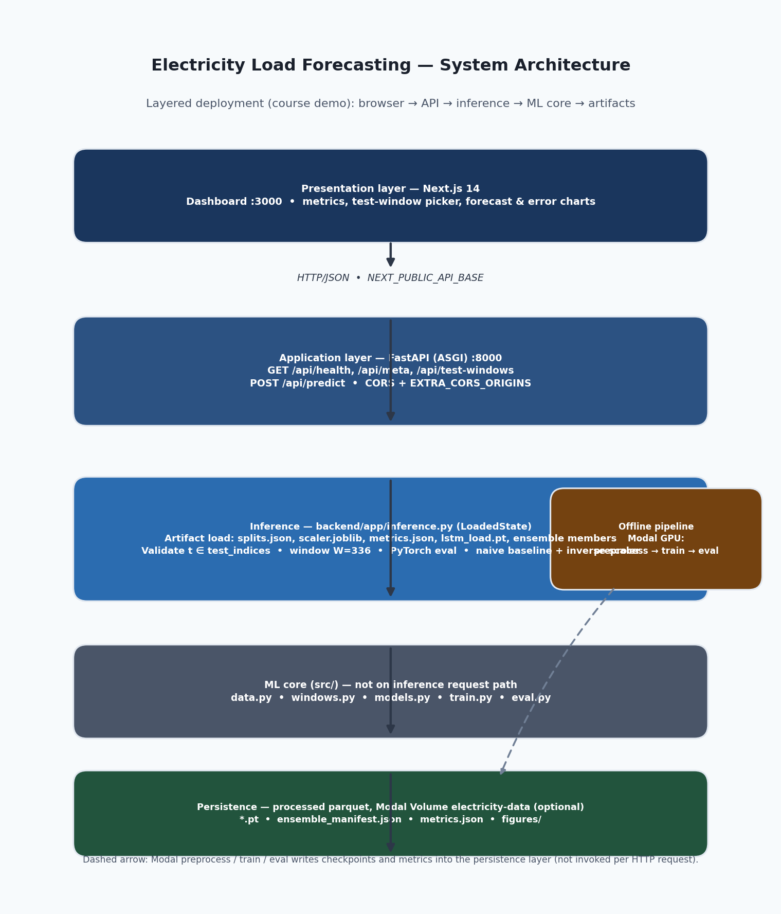

<!--
  Course project report (markdown source). Build Word: python3 scripts/build_srs_docx.py
-->

**National University of Computer & Emerging Sciences, Karachi**

# Deep Learning Electricity Load Forecasting System

**Course:** Software Engineering  
**Semester:** Spring 2026  

**Prepared By**  
Abdul Wasay — 23L-0658  
Haseeb Asif — 23K-0539  

---

### Abstract

This project report documents the **Deep Learning Electricity Load Forecasting System**: scope, functional and non-functional requirements, work breakdown structure, system architecture, test cases for key functionality, and a categorized risk assessment—per the Spring 2026 Software Engineering project requirements.

---

## 1. Project title and group members

| Field | Value |
|-------|-------|
| **Project title** | Deep Learning Electricity Load Forecasting System |
| **Group members** | Abdul Wasay — 23L-0658; Haseeb Asif — 23K-0539 |

---

## 2. Project scope

The system is a **prototype forecasting application**—not a grid control or billing system.

**In scope**

- **Offline ML pipeline:** Ingest UCI electricity data (`LD2011_2014.txt`), preprocess to hourly resolution, chronological train (80%) / validation (10%) / test (10%) splits, **RobustScaler** fit on train only, PyTorch LSTM training with optional multi-seed checkpoints, seasonal naive baseline, evaluation producing `metrics.json` and figures—runnable on Modal with Volume `electricity-data` for reproducibility.
- **Runtime demo stack:** FastAPI service with health, metadata, paginated test-window listing, and per-window inference (**single best** checkpoint or **ensemble mean** when members exist).
- **Web UI:** Next.js dashboard showing aggregate test metrics, model mode selection, test-window selection/filtering, and charts comparing LSTM forecast, ground truth, and naive baseline over a **24-hour** horizon (with **336-hour** input history).

**Out of scope**

- Live SCADA/MQTT ingestion; production SLAs or regulatory compliance; multi-tenant authentication; commercial multi-customer deployment; training inside the web request path; automatic retraining triggers.

---

## 3. Functional requirements

### 3.1 Data preprocessing

| ID | Requirement |
|----|-------------|
| FR-1 | The system shall ingest `LD2011_2014.txt` (semicolon SEP, comma decimal) from the published UCI ZIP source. |
| FR-2 | The system shall resample sub-hourly readings to **mean hourly** kW and persist a parquet representation including derived DST indicator columns (`is_march_dst_short`, `is_october_dst_long`, `is_dst_window`). |
| FR-3 | The system shall trim leading stationary near-zero inactive prefix before modeling per preprocessing rules documented in pipeline materials. |
| FR-4 | The system shall fit **RobustScaler** exclusively on training-segment loads and reuse those parameters during validation/test window construction and inference. |
| FR-5 | The system shall materialize chronological split boundaries (train 80%, validation 10%, test 10%) surfaced through `splits.json`. |

### 3.2 Model training and baseline

| ID | Requirement |
|----|-------------|
| FR-6 | The system shall expose an LSTM architecture accepting sliding windows shaped **(336 timesteps × 8 features)** (scaled load, sinusoidal hour/DOW encodings, DST flags). |
| FR-7 | The system shall implement a seasonal naive predictor using primary lag **168 h** per horizon step, with **24 h** fallback where required. |
| FR-8 | The system shall support optional training across multiple RNG seeds exporting distinct member checkpoints and a manifest documenting validation MAE in kW and best_seed selection. |

### 3.3 Evaluation and metrics

| ID | Requirement |
|----|-------------|
| FR-9 | The evaluation routine shall optionally **average ensemble member scaled-space outputs** prior to inverse scaling when multiple compatible checkpoints exist. |
| FR-10 | The system shall write `metrics.json` containing at minimum test MAE/RMSE for LSTM vs naive **in kW**, sMAPE, skill score versus naive, count of enumerated test windows, and ensemble membership metadata. |

### 3.4 Inference API

| ID | Requirement |
|----|-------------|
| FR-11 | The REST service shall expose `GET /api/health` returning availability boolean, served model modality labels, total valid **test-origin** indices. |
| FR-12 | `GET /api/meta` shall return fused metadata: meter id, chronological coverage, window (`W`) and horizon (`H`), first/last test prediction timestamps, raw `metrics`, optional ensemble manifest parity with disk JSON, plus serialized training-config snapshot fragments. |
| FR-13 | `GET /api/test-windows` shall paginate enumerated legal indices with ISO timestamps bounding each window, optionally filterable (`q=` date prefix) plus `random=` convenience flag. |
| FR-14 | `POST /api/predict` shall accept `{t, model∈{"single","ensemble"}}`, reject illegal `t`, assemble context history length **W**, produce **H** predicted kW vectors, naive baseline, residuals, and window MAE/RMSE/sMAPE and skill vs naive. |
| FR-15 | Service startup shall fail fast with actionable guidance if required artifact files are missing, enumerating search order for processed parquet path resolution. |

### 3.5 Web dashboard

| ID | Requirement |
|----|-------------|
| FR-16 | Dashboard shall render global cards summarizing stored aggregate test metrics (MAE, RMSE, sMAPE, skill, NMAE%, ensemble size). |
| FR-17 | User shall toggle inference between **Single best** and **Ensemble mean** when backend advertises availability. |
| FR-18 | User shall select or filter at least one valid test window and trigger prediction display without manual tensor construction. |
| FR-19 | Visualization shall plot trailing **72 h** historical actual load joined with **24 h** overlay of model forecast, ground truth, and naive curve with a vertical marker at the first predicted hour. |
| FR-20 | Secondary chart shall compare absolute per-horizon-step errors for LSTM vs naive (24 grouped bars). |
| FR-21 | Localized per-window summary statistics shall update after each successful prediction request. |

---

## 4. Non-functional requirements

| ID | Category | Requirement |
|----|----------|-------------|
| NFR-1 | Usability | A first-time reviewer shall complete a valid forecast visualization path (select window → view charts) in **≤ 5 minutes** following README instructions. |
| NFR-2 | Performance | Single-window prediction round-trip (local CPU) shall typically complete **< 2 s** excluding network latency; cold model load occurs at process start, not per request. |
| NFR-3 | Reliability | Invalid `t` or absent artifacts shall yield structured HTTP 4xx/5xx with descriptive JSON/text body—no silent partial tensors. |
| NFR-4 | Maintainability | Separation of concerns: `src` training core vs `backend` serving vs `frontend` UI; configuration constants centralized (`src/config.py`). |
| NFR-5 | Portability | Stack runs on macOS/Linux/Windows with documented dependency installs (`requirements.txt`, `npm`). |
| NFR-6 | Reproducibility | Training seeds enumerated; manifest records multiple members; evaluation label distinguishes ensemble vs single in metrics file. |
| NFR-7 | Observability | Health endpoint supports minimal operational ping; logging of startup failures includes missing file enumeration. |
| NFR-8 | Explainability | UI differentiates model vs naive vs actual; summary skill metric contextualizes uplift over naive. |

---

## 5. Work Breakdown Structure (WBS)

| WBS ID | Work package | Description | Key deliverables |
|--------|--------------|-------------|------------------|
| 1.0 | **Project management** | Scope, milestones, demo rehearsal | Project report; demo readiness |
| 2.0 | **Requirements baseline** | FR/NFR definition aligned to implementation | Requirement tables in this report |
| 3.0 | **Data acquisition** | Obtain UCI ZIP; place under `data/` or Modal Volume `/raw` | `electricityloaddiagrams20112014.zip` available |
| 3.1 | **Preprocessing pipeline** | Hourly resample, trim, DST flags, parquet, `splits.json`, train-only scaler | `src/data.py` outputs; `processed/*.parquet`; `scaler.joblib` |
| 4.0 | **Supervised windowing** | Build `(W=336, F=8)` tensors; chronological splits; no test leakage | `src/windows.py` integrated with splits |
| 4.1 | **Model core** | LSTM encoder, horizon head **H=24**, config parity with checkpoint | `src/models.py`; `src/config.py` |
| 4.2 | **Training and checkpointing** | Modal GPU train; optional multi-seed ensemble | `src/train.py`; `modal_app.py` artifacts |
| 4.3 | **Baseline and evaluation** | Seasonal naive; test metrics; figures | `src/eval.py`; `metrics.json`; `figures/*.png` |
| 5.0 | **Inference API** | FastAPI lifespan load; health, meta, test-windows, predict | `backend/app/*` |
| 6.0 | **Web dashboard** | Next.js UI: metrics, window picker, charts, model toggle | `frontend/*`; README |
| 7.0 | **Cloud automation** | Modal Volume lifecycle; preprocess/train/eval/download | `modal_app.py`; `modal volume` usage |
| 8.0 | **Integration and test execution** | End-to-end demo; automated + manual test cases | `testing/` (pytest); evidence of TC runs |
| 9.0 | **Documentation and submission** | README, pipeline notes, report export | `README.md`, `testing/README.md`, `pipeline.md`, this report (`.md` / `.docx`) |

**Dependencies:** 3.1 precedes 4.x; 4.2–4.3 precede 5.0; 5.0 precedes 6.0 for full UI demo.

---

## 6. Architecture diagram

The diagram shows the **course demo** deployment: synchronous inference (center stack) and **offline** Modal training that writes the same artifacts the API loads at startup.

*Figure 1. Layered system architecture: Next.js → FastAPI → inference (`LoadedState`) → ML modules in `src/` (offline training path) → persistence. Dashed path: Modal preprocess/train/eval writes checkpoints and metrics.*

---

## 7. Test cases

Formal tests assume a running backend with valid artifacts (`lstm_load.pt`, `scaler.joblib`, `splits.json`, processed parquet, `metrics.json`) and optional ensemble checkpoints.

| TC ID | Related FRs | Objective | Preconditions | Steps (summary) | Expected result |
|-------|-------------|-----------|---------------|-----------------|-------------------|
| **TC-01** | FR-11 | Service health and test-window count. | API started; state loaded. | `GET /api/health`. | HTTP 200; `ok` true; `models` non-empty; `n_test_windows` > 0. |
| **TC-02** | FR-12 | Metadata matches config and on-disk metrics. | TC-01 pass. | `GET /api/meta`; compare `window`,`horizon` to 336, 24; check `metrics`. | HTTP 200; `window`=336, `horizon`=24; metrics consistent with `metrics.json`. |
| **TC-03** | FR-13 | Paginated test-window list. | TC-01 pass. | `GET /api/test-windows?limit=5&offset=0`. | HTTP 200; items ≤ 5; each has `t`, `first_pred_time`, `last_pred_time`. |
| **TC-04** | FR-13 | Date-prefix filter. | TC-01 pass; valid `q` prefix. | `GET /api/test-windows?q=<ISO prefix>`. | HTTP 200; every `first_pred_time` starts with `q`. |
| **TC-05** | FR-13 | Random valid window. | TC-01 pass. | `GET /api/test-windows?random=true`. | HTTP 200; exactly one item; `t` in test set. |
| **TC-06** | FR-14 | Valid prediction payload. | Valid `t`. | `POST /api/predict` `{"t":<valid>,"model":"single"}`. | HTTP 200; forecast arrays length 24; history length 336; `summary` has MAE/RMSE/sMAPE/skill. |
| **TC-07** | FR-14, NFR-3 | Invalid `t` rejected. | API running. | `POST /api/predict` with invalid `t`. | HTTP **400**; message describes valid range. |
| **TC-08** | FR-14 | Single vs ensemble when members exist. | Multi-seed artifacts optional. | Same `t`, `model` `single` then `ensemble`. | HTTP 200; `n_members` ≥ 1; ensemble increases members when checkpoints exist. |
| **TC-09** | FR-16–FR-21 | Dashboard end-to-end. | Frontend + backend up. | Load UI; pick window; predict; view charts. | Metric cards and charts show actual, LSTM, naive; per-window stats update. |

### 7.1 Automated tests in the codebase

The repository includes a **`testing/`** folder (pytest) that encodes checks against the same modules described in scope: `src/windows.py`, `backend/app/inference.py`, and `backend/app/main.py`.

| Path | Role |
|------|------|
| `testing/README.md` | How to install deps and run `pytest testing`. |
| `pytest.ini` | Repo-root config: `pythonpath` includes `.` and `backend` so `src` and `app` imports resolve. |
| `testing/conftest.py` | Injects `sys.path`; fixtures `minimal_state` (synthetic `LoadedState`) and `api_client` (patches `load_state` so no `artifacts/` are required). |
| `testing/fixtures_minimal_state.py` | Builds in-memory hourly data, `RobustScaler`, `split_indices`, `build_feature_arrays`, and a small `LSTMForecaster` for API tests. |
| `testing/test_api_contracts.py` | HTTP tests named for **TC-01–TC-08** (`/api/health`, `/api/meta`, `/api/test-windows`, `/api/predict`). |
| `testing/test_split_indices.py` | Unit tests for chronological test-window index ranges. |
| `testing/test_naive_and_smape.py` | Unit tests for `seasonal_naive_forecast` and `smape`. |

**Note:** **TC-09** (Next.js UI) is not automated here; run manually with `npm run dev` and the live API.

---

## 8. Risk assessment

**Likelihood (L)** and **impact (I):** L = Low, M = Medium, H = High.

**Technical**

| ID | Risk description | L | I | Mitigation |
|----|------------------|---|---|------------|
| R-T1 | LSTM **skill vs seasonal naive** negative on held-out windows (regime shift). | M | M | Report skill in `metrics.json` and UI; residual figures; limit claims to test period. |
| R-T2 | **Checkpoint / scaler / splits mismatch** after retrain. | M | H | Train and evaluate together; FR-15 fail-fast messages; single artifact bundle. |
| R-T3 | **GPU or Modal limits** interrupt ensemble training. | M | M | Tunable `HIDDEN_SIZE` and seeds; `train_quick_cli`; document OOM handling. |
| R-T4 | **Window/shape errors** in tensors. | L | H | Pydantic schemas; strict `t` validation; fixed **W=336, H=24, F=8**. |

**Schedule and academic delivery**

| ID | Risk description | L | I | Mitigation |
|----|------------------|---|---|------------|
| R-S1 | **Modal queue or long preprocess** delays deadlines. | M | M | Documented run order; cached `artifacts/` for UI-only demo. |
| R-S2 | **Late integration issues** (API URL, CORS). | M | H | Early full-stack rehearsal; `NEXT_PUBLIC_API_BASE`; `EXTRA_CORS_ORIGINS`. |

**Operational (runtime, deployment)**

| ID | Risk description | L | I | Mitigation |
|----|------------------|---|---|------------|
| R-O1 | API **fails to start** (missing files/paths). | M | H | FR-15; documented path resolution; README layout. |
| R-O2 | **Browser cannot reach API** (ports, CORS). | M | M | Document ports 3000/8000; CORS middleware. |

**Data and external dependencies**

| ID | Risk description | L | I | Mitigation |
|----|------------------|---|---|------------|
| R-D1 | **Missing or corrupt UCI ZIP**. | L | H | Documented upload paths to Modal Volume / local `data/`. |
| R-D2 | **DST feature misalignment** vs Portuguese wall clock. | M | M | Consistent rules in `src/data.py`. |
| R-D3 | **Modal or network outage** during retrain. | L | M | Pre-downloaded artifacts; demo without live training. |

**Security, compliance, and scope (prototype)**

| ID | Risk description | L | I | Mitigation |
|----|------------------|---|---|------------|
| R-C1 | **Unauthenticated REST/OpenAPI**—demo only, not production. | H | L | Non-production scope (§2); not exposed to public internet in grading scenario. |
| R-C2 | **Forecasts misused** as dispatch or commercial advice. | M | M | Prototype disclaimer; educational use only. |

**Resource and team**

| ID | Risk description | L | I | Mitigation |
|----|------------------|---|---|------------|
| R-R1 | **Knowledge concentration** on Modal/training. | M | M | README, `explain.md`, shared walkthrough. |

**Summary:** **15** risks across **five** categories (meets “at least 10 risks as per category” as a categorized register).

---

**Document status:** Project report aligned to instructor checklist (Spring 2026).

---

### *End of Project Report*
